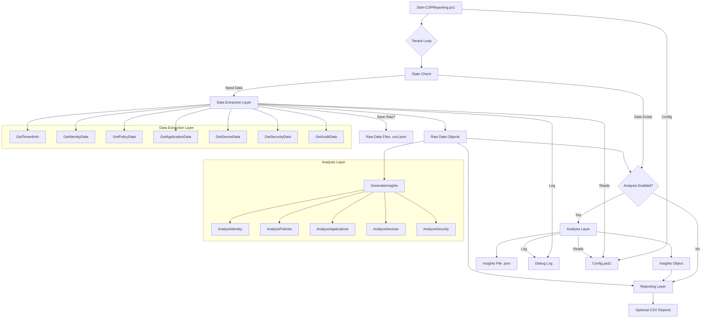

# CSP Reporting Framework v2 - Architecture Upgrade Plan

**1. Introduction & Goals**

This plan outlines the architecture for upgrading the CSP Reporting PowerShell framework. The primary goals are:

*   **Expand Data Extraction:** Significantly increase the scope of data collected via the Microsoft Graph API to cover key security and configuration areas identified in `Design/v2_data_sources_GraphAPI_Queries.md`.
*   **Implement Analysis Layer:** Introduce a new, distinct layer to analyze the extracted raw data, apply configurable rules, and generate structured JSON insights (`TenantName_Insights.json`) as described in `Design/v2_planning.md`.
*   **Enhance Framework:** Ensure the upgrade adheres to principles of modularity, defensive coding, comprehensive debug logging, and leverages existing framework capabilities (auth, resumability, logging).

**2. Guiding Principles**

*   **Modularity:** Data extraction and data analysis logic will reside in separate, dedicated PowerShell modules.
*   **Separation of Concerns:** Extraction modules focus on retrieving raw data; Analysis modules focus on interpreting data and generating insights.
*   **Defensive Coding:** Handle API errors, missing data, licensing gaps gracefully. Use retry logic.
*   **Comprehensive Logging:** Detailed debug logging throughout using existing module. Log function calls, parameters, API calls, errors, analysis decisions, prerequisites.
*   **Configuration Driven:** Manage analysis thresholds, feature toggles, rules via `Config.psd1`.

**3. Proposed Module Structure**

```powershell
Modules/
├── Core/                     # Existing core functions (Auth, Logging, State, Utils, ApiHelpers, CertUtils)
│   ├── Auth.psm1
│   ├── LoggingAndProgress.psm1
│   ├── StateManagement.psm1
│   ├── Utilities.psm1
│   ├── ApiHelpers.psm1         # Enhanced for broader Graph API use
│   └── CertificateUtils.psm1
│
├── DataExtraction/           # NEW/Refactored: Raw data retrieval (TenantInfo, Identity, Policy, App, Device, Security, Audit)
│   ├── GetTenantInfo.psm1      # Basic tenant details, domains, org settings
│   ├── GetIdentityData.psm1    # Users, Groups, Auth Methods, Roles, PIM
│   ├── GetPolicyData.psm1      # Conditional Access, Auth Methods Policy, Auth Strengths
│   ├── GetApplicationData.psm1 # App Registrations, Service Principals, Permissions
│   ├── GetDeviceData.psm1      # Intune Managed Devices (handles licensing)
│   ├── GetSecurityData.psm1    # Identity Protection Risk, Security Defaults
│   └── GetAuditData.psm1       # Directory Audits, Sign-ins (with robust filtering)
│
├── Analysis/                 # NEW: Insight generation (Identity, Policies, Apps, Devices, Security, Orchestrator)
│   ├── AnalyzeIdentity.psm1    # MFA checks, stale accounts, guest analysis, role analysis
│   ├── AnalyzePolicies.psm1    # CA policy gaps, legacy auth checks
│   ├── AnalyzeApplications.psm1# High-privilege apps, credential expiry
│   ├── AnalyzeDevices.psm1     # Compliance summaries
│   ├── AnalyzeSecurity.psm1    # Risk summaries, SecDefaults status
│   └── GenerateInsights.psm1   # Orchestrates analysis, builds Insights.json
│
└── Reporting/                # Existing/Refactored: Output formatting (CSV, etc.)
    ├── Reports.psm1            # Existing CSV generation (may be simplified)
    └── ReportingUtils.psm1     # Helper functions for reporting
```

**4. Data Extraction Layer Details**

*   **Core:** Enhance `ApiHelpers.psm1` for robust Graph API interaction (pagination, select, filter, count, headers, retry logic).
*   **Modules:** Each `Get*.psm1` contains functions for its domain (e.g., `Get-CSPUserData`, `Get-CSPConditionalAccessPolicies`, `Get-CSPManagedDeviceData`).
*   **Functions:** Specify API endpoint, `$select` properties, handle paging, implement error/license handling (log skips/warnings), output raw PSCustomObjects.

**5. Analysis Layer Details**

*   **Core:** `GenerateInsights.psm1` contains `Invoke-CSPTenantAnalysis` to orchestrate analysis. Takes raw data, calls analysis functions, builds and returns the `Insights.json` object per the spec.
*   **Modules:** Each `Analyze*.psm1` contains specific check functions (e.g., `Find-CSPAdminsWithoutMFA`, `Analyze-CSPConditionalAccessPolicies`, `Find-CSPStaleGuestAccounts`).
*   **Functions:** Take raw data and config settings, apply logic, output "Finding" objects matching the spec.
*   **Rules:** Defined in `Config.psd1`.
*   **Output:** Strictly adhere to the `Insights.json` format (`TenantId`, `TenantName`, `ReportTimestamp`, `SummaryMetrics`, `Findings` array with `FindingID`, `Category`, `Severity`, `Title`, `Description`, `Details`, `Recommendation`).

**6. Integration Flow (`Start-CSPReporting.ps1`)**

1.  Init (Config, Log, Auth).
2.  Tenant Loop.
3.  State Check (Resume/Skip?).
4.  **Data Extraction:** Call `Get-*` functions, handle errors/licenses, store raw data, update state.
5.  **Analysis (Conditional):** If enabled, call `Invoke-CSPTenantAnalysis`, get Insights object, save to JSON, update state.
6.  **Reporting (Optional):** Generate CSVs.
7.  Cleanup.

**7. Configuration (`Config.psd1`) Changes**

*   Add `Analysis` section: `EnabledChecks` toggles, `Thresholds & Rules` (e.g., `StaleGuestThresholdDays`, `CredentialExpiryWarningDays`, `AdminRoles`, `HighRiskAppPermissions`).
*   Add `Reporting` toggles: `GenerateInsightsJson`, `SaveRawDataFiles`.
*   Add `DataExtractionToggles`: `IncludeDeviceData`, `IncludeRiskData`, `IncludeAuditLogs`, `AuditLogDays`.

```powershell
# Example Config Snippet
# Analysis Settings
Analysis = @{
    # Feature Toggles (Enable/Disable specific analysis areas)
    EnabledChecks = @{
        Identity          = $true
        Policies          = $true
        Applications      = $true
        Devices           = $true # Will be skipped if Intune data unavailable
        Security          = $true # Will be skipped if Risk data unavailable
    }

    # Thresholds & Rules
    StaleGuestThresholdDays     = 90
    CredentialExpiryWarningDays = 30
    AdminRoles = @(
        'Global Administrator',
        'Security Administrator',
        'Exchange Administrator',
        'SharePoint Administrator',
        'Conditional Access Administrator',
        'Privileged Role Administrator'
        # Add other relevant roles
    )
    HighRiskAppPermissions = @(
        'Directory.ReadWrite.All',
        'RoleManagement.ReadWrite.Directory',
        'Mail.ReadWrite',
        'Sites.FullControl.All'
        # Add other high-risk permissions
    )
    # Add other configurable parameters as needed (e.g., weak CA controls)
}

# Reporting Settings
Reporting = @{
    # Existing settings...
    GenerateInsightsJson = $true # Toggle for the new Insights JSON output
    SaveRawDataFiles   = $false # Optionally save intermediate raw data
    # ...
}

# Add toggles for specific data extraction areas if needed for fine-grained control
DataExtractionToggles = @{
    IncludeDeviceData = $true
    IncludeRiskData   = $true
    IncludeAuditLogs  = $true # Note: Audit log extraction can be time-consuming
    AuditLogDays      = 30    # Days of audit logs to retrieve
}
```

**8. Defensive Coding & Logging Guidelines**

*   **Errors:** Use `Try/Catch`, log errors, check for `$null`/empty results, check licenses explicitly, validate data.
*   **Debug Logs:** Log function entry/exit, API calls, item counts, analysis decisions, skips (license/data), use consistent format.

**9. High-Level Data Flow (Mermaid Diagram)**



**10. Conclusion**

This plan provides a modular, robust architecture for extending the framework, separating extraction and analysis, enabling defensive coding, and generating actionable insights.