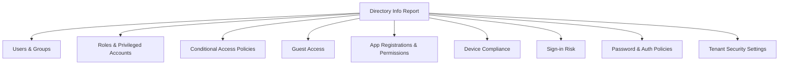

For a **Directory Info Report** aimed at Managed Service Providers (MSPs) managing multiple Microsoft 365 and Azure tenants, here are valuable data points and security insights to include beyond just user and group listings:

### **Core Directory Inventory**
- **Users:** All users with key attributes (enabled/disabled, license status, roles, MFA status summary)
- **Groups:** Security groups, Microsoft 365 groups, dynamic groups, membership counts
- **Roles:** Admin roles assigned, including privileged roles (Global Admin, Security Admin, etc.)
- **Licenses:** Assigned licenses and service plans per user

---

### **Security & Compliance Insights**

#### **Conditional Access Policies**
- List all policies with:
  - Enabled/disabled state
  - Conditions (users/groups targeted, device/platform/location filters)
  - Grant controls (MFA required, compliant device, etc.)
  - Session controls
- Highlight risky or overly permissive policies (e.g., policies allowing legacy auth)

#### **Privileged Role Assignments**
- Users with permanent or eligible privileged roles (PIM)
- Accounts with multiple high-privilege roles
- Accounts with no MFA but privileged roles

#### **Guest Access**
- Number of guest users
- Guests with access to sensitive resources
- External sharing settings (SharePoint, Teams)

#### **Application Registrations & Enterprise Apps**
- Apps with high permissions (Directory.ReadWrite.All, User.ReadWrite.All, ability to read all email, etc.)
- Consent granted by admins vs. users
- Apps with expired or expiring secrets/certificates

#### **Device Compliance**
- Number of compliant vs. non-compliant devices (if Intune is used)
- Devices without recent check-in
- Devices with risky status

#### **Sign-in Risk & Identity Protection**
- Users flagged with risky sign-ins
- Users at risk state (if Azure AD Identity Protection is licensed)

#### **Password Policies & Authentication Methods**
- Password expiration policies
- Passwordless methods enabled (FIDO2, Windows Hello)
- Legacy authentication usage (basic auth protocols still allowed)

---

### **Tenant Configuration & Hygiene**
- **Security Defaults:** Enabled or not
- **Legacy Authentication:** Enabled protocols
- **Self-service Password Reset:** Enabled and scoped users
- **Multi-Geo settings:** If applicable
- **Azure Subscriptions linked:** Overview of linked Azure resources

---

### **Summary**

| **Category**                     | **Why It Matters**                                               |
|----------------------------------|------------------------------------------------------------------|
| Conditional Access               | Enforce secure access, spot risky gaps                          |
| Privileged Roles                 | Minimize attack surface, enforce least privilege                |
| Guest Access                     | Control external collaboration risks                            |
| App Permissions                  | Detect over-privileged or risky apps                            |
| Device Compliance                | Ensure secure endpoints                                         |
| Sign-in Risk                     | Detect compromised accounts                                     |
| Password & Auth Policies         | Enforce strong authentication, reduce legacy risks              |
| Tenant Security Settings         | Overall security posture assessment                             |

---

### **Visual Overview**

---

### **Conclusion**

A comprehensive Directory Info Report should **combine inventory with security insights** to help MSPs:

- **Spot misconfigurations**
- **Identify risky accounts or apps**
- **Track compliance with security baselines**
- **Prioritize remediation efforts**

This will provide **actionable intelligence** rather than just raw data, enabling proactive management of client environments.