# Refactoring Plan for CSP Reporting v2 Preparation

## 1. Goal

Refactor the existing PowerShell application structure (`Start-CSPReporting.ps1` and its modules) to improve modularity, maintainability, and scalability in preparation for adding the expanded data queries required for v2. A key objective is to reduce the size of large script files (`Utilities.psm1`, `Reports.psm1`) to enhance compatibility with LLM-based development tools and improve overall code organization.

## 2. Analysis of Current Structure

*   **`Modules/Utilities.psm1`:** Overly large, handling diverse tasks (state, logging, progress, API retries, certificates, module management, color output, consent). **Primary refactoring target.**
*   **`Modules/Reports.psm1`:** Contains report generation logic. Adding all planned v2 queries here would make it unmanageable. **Needs restructuring.**
*   **`Start-CSPReporting.ps1`:** Main script, requires updates to use refactored modules.
*   **`Modules/Auth.psm1`:** Focused on authentication, can remain as is.
*   **`Config.psd1`:** Configuration, no structural changes needed for this phase.

## 3. Proposed Refactored Structure

The core strategy involves breaking down large modules into smaller, single-responsibility modules and creating a dedicated structure for data extraction functions.

```mermaid
graph TD
    subgraph Main Script
        A[Start-CSPReporting.ps1]
    end

    subgraph Core Modules
        B(Modules/Auth.psm1)
        C(Modules/Config.psd1)
    end

    subgraph Refactored Utility Modules
        U1(Modules/StateManagement.psm1)
        U2(Modules/LoggingAndProgress.psm1)
        U3(Modules/ApiHelpers.psm1)
        U4(Modules/CertificateUtils.psm1)
        U5(Modules/ModuleManagement.psm1)
        U6(Modules/ConsentUtils.psm1)
        U7(Modules/ReportingUtils.psm1) -- Handles Export/Format --> U2
    end

    subgraph Data Extraction Modules
        D[Modules/DataExtraction/]
        D1(Modules/DataExtraction/Identity.psm1)
        D2(Modules/DataExtraction/SecurityPosture.psm1)
        D3(Modules/DataExtraction/PrivilegedAccess.psm1)
        D4(Modules/DataExtraction/Applications.psm1)
        D5(Modules/DataExtraction/DeviceManagement.psm1)
        D6(Modules/DataExtraction/RiskAndAudit.psm1)
        D7(Modules/DataExtraction/Usage.psm1)
    end

    A --> B; A --> C;
    A --> U1; A --> U2; A --> U3; A --> U4; A --> U5; A --> U6; A --> U7;

    A --> D1; A --> D2; A --> D3; A --> D4; A --> D5; A --> D6; A --> D7;

    %% Dependencies: Data Extraction modules depend on Utility modules
    D1 & D2 & D3 & D4 & D5 & D6 & D7 --> U2 & U3 & U7

    style D fill:#f9f,stroke:#333,stroke-width:2px
```

## 4. Detailed Refactoring Steps

1.  **Create New Utility Modules:**
    *   Create the following new files:
        *   `Modules/StateManagement.psm1`
        *   `Modules/LoggingAndProgress.psm1`
        *   `Modules/ApiHelpers.psm1` (for `Invoke-CSPWithRetry`)
        *   `Modules/CertificateUtils.psm1` (for `New-CSPSelfSignedCertificate`, `Get-CSPCertificateThumbprint`)
        *   `Modules/ModuleManagement.psm1` (for `Initialize-CSPModules`, `Test-CSPModuleAvailability`)
        *   `Modules/ConsentUtils.psm1` (for `Test-CSPAdminConsent`, `Invoke-CSPAdminConsent`)
        *   `Modules/ReportingUtils.psm1` (for `Export-CSPReportData`, `Format-CSPReportFileName` - moved from `Reports.psm1`)
    *   Move the corresponding functions from the original `Modules/Utilities.psm1` (and `Reports.psm1` for reporting utils) into these new modules.
    *   Ensure each new module exports its public functions using `Export-ModuleMember`.
    *   Update internal function calls within these new modules if they now reside in a different module (e.g., logging functions called from state management).

2.  **Create Data Extraction Modules:**
    *   Create the directory: `Modules/DataExtraction/`.
    *   Create initial data extraction module files within this directory:
        *   `Modules/DataExtraction/Identity.psm1`
        *   `Modules/DataExtraction/SecurityPosture.psm1`
        *   `Modules/DataExtraction/PrivilegedAccess.psm1`
        *   `Modules/DataExtraction/Applications.psm1`
        *   `Modules/DataExtraction/DeviceManagement.psm1`
        *   `Modules/DataExtraction/RiskAndAudit.psm1`
        *   `Modules/DataExtraction/Usage.psm1`
    *   Move existing report generation functions (e.g., `Get-CSPMFAReport` from `Reports.psm1`) into the most appropriate new module (e.g., `Identity.psm1`). Consider renaming for clarity (e.g., `Get-CSPExtractionMfaStatus`).
    *   Ensure these new modules export their public functions.
    *   These modules will serve as the location for implementing the new v2 data queries.

3.  **Update `Start-CSPReporting.ps1`:**
    *   Remove `Import-Module` statements for `Modules/Utilities.psm1` and `Modules/Reports.psm1`.
    *   Add `Import-Module` statements for all the newly created utility modules (`StateManagement.psm1`, `LoggingAndProgress.psm1`, etc.) and the new data extraction modules (`Identity.psm1`, etc.).
    *   Review the script and update all function calls to reflect their new module locations.

4.  **Clean Up:**
    *   After thorough testing confirms the refactored code works correctly, delete (or archive) the original `Modules/Utilities.psm1` and `Modules/Reports.psm1` files.

## 5. Benefits of this Refactoring

*   **Improved Maintainability:** Smaller, focused files are easier to manage.
*   **Reduced Complexity:** Clearer separation of concerns.
*   **LLM Friendliness:** Addresses the file size constraints for better interaction with AI tools.
*   **Scalability:** Provides a logical structure for adding new v2 data extraction functions.
*   **Testability:** Smaller units are potentially easier to test individually.

## 6. Next Steps

Implement the refactoring steps outlined above using the `code` mode.